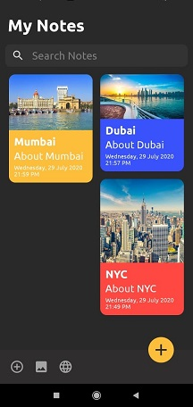

# NewNotesApp
## Added Functionalities for sharing note through WhatsApp. 
### Notes App Similar to app developed by [Chirag Kachhadiya](https://youtu.be/hlkekoPqsis)
---
A beautifully designed predominantly dark, notes app.
A personal training project to use newer UI/UX elements and room database structure.
Implements the following Android elements.
- XML
- Room Library for persistent data storage
- Recycler View
- Scalable Size Unit
- Material Design
- Rounded ImageView

### Screenshots
  
 
 
 
 
 
 
 
### To Do List
- [ ] Convert Room Database to JSON Structure to store on firebase
- [ ] Add Login Support for online databackup
- [ ] Finishing Changes Save on exit
